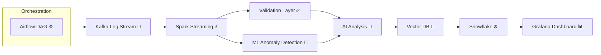

# 🚀 AI Pipeline Assistant v2

### ⚡ Enterprise-Grade AI + Data Engineering Platform

<p align="center">
  
  
  
  
  
  
</p>

---

## 🌟 What is this?

> 🧠 An AI-powered assistant that **automatically detects, diagnoses, and fixes data pipeline failures**

This project simulates a **real enterprise data platform** where:

* Logs flow through streaming pipelines 📡
* Data is validated and processed ⚙️
* AI detects issues and suggests fixes 🤖
* Everything is monitored and production-ready 📊

---

## ✨ Key Features

🔥 **Real-Time Streaming**

* Kafka-based pipeline log ingestion
* Spark Structured Streaming processing

🧠 **AI Root Cause Analysis**

* Uses OpenAI to detect failure causes
* Suggests fixes + prevention strategies

📊 **Data Quality & Validation**

* Great Expectations checks
* Schema drift detection

📦 **Modern Data Stack**

* Databricks-ready notebooks
* Snowflake ingestion layer

📈 **Observability**

* Grafana dashboards
* Failure tracking

🧬 **ML + Intelligence**

* Anomaly detection using Isolation Forest
* Log pattern learning

🔎 **RAG + Vector Search**

* ChromaDB vector store
* Semantic search on historical logs

⚙️ **Production Ready**

* Airflow orchestration
* Kubernetes deployment
* CI/CD with GitHub Actions

---

## 🧩 Architecture (Workflow)



---

## 🛠️ Tech Stack

| Layer         | Tools               |
| ------------- | ------------------- |
| Streaming     | Kafka               |
| Processing    | Spark + Scala       |
| Platform      | Databricks          |
| Storage       | Snowflake           |
| API           | FastAPI             |
| AI            | OpenAI              |
| ML            | Scikit-learn        |
| Validation    | Great Expectations  |
| Vector DB     | ChromaDB            |
| Orchestration | Airflow             |
| Monitoring    | Grafana             |
| Deployment    | Docker + Kubernetes |
| CI/CD         | GitHub Actions      |

---

## 📁 Project Structure

```
ai_pipeline_assistant_v2/
│
├── app/                  # FastAPI backend + AI logic
├── producer/             # Kafka log generator
├── spark_jobs/           # Spark streaming jobs
├── airflow/              # DAG orchestration
├── great_expectations/   # Data validation
├── snowflake/            # Data warehouse layer
├── grafana/              # Dashboard configs
├── databricks/           # Notebook examples
├── k8s/                  # Kubernetes deployment
├── tests/                # Unit tests
├── .github/workflows/    # CI/CD pipelines
│
└── docker-compose.yml    # Local setup
```

---

## ⚡ Quick Start (Local Setup)

### 1️⃣ Clone Repo

```bash
git clone https://github.com/yourusername/ai-pipeline-assistant.git
cd ai-pipeline-assistant
```

### 2️⃣ Setup Environment

```bash
python -m venv venv
source venv/bin/activate   # Windows: venv\Scripts\activate
pip install -r requirements.txt
```

### 3️⃣ Start Kafka + Grafana

```bash
docker-compose up -d
```

### 4️⃣ Run Log Producer

```bash
python producer/log_producer.py
```

### 5️⃣ Start API

```bash
uvicorn app.main:app --reload
```

### 6️⃣ Run Spark Job

```bash
spark-submit spark_jobs/log_processor.py
```

### 7️⃣ Run Airflow

```bash
airflow standalone
```

---

## 🔥 API Usage

### Endpoint:

```
POST /analyze
```

### Example:

```json
{
  "log": "Schema mismatch detected in pipeline"
}
```

### Response:

```json
{
  "anomaly": false,
  "analysis": {
    "root_cause": "...",
    "fix": "..."
  }
}
```

---

## 📊 Sample Use Cases

✔ Detect schema mismatches
✔ Identify memory failures (OOM)
✔ Diagnose Kafka timeouts
✔ Suggest Spark optimizations
✔ Auto-generate fixes

---

## 🧠 Why This Project is Powerful

This is NOT just another ETL project.

It demonstrates:

* Real-time streaming pipelines
* AI-powered debugging
* Production-grade architecture
* Modern data stack mastery
* End-to-end ownership

---

## 💼 Resume Gold Bullet

```
Developed an enterprise AI-powered data engineering platform using Kafka, Spark Structured Streaming, Scala, Airflow, Snowflake, Kubernetes, Great Expectations, and OpenAI APIs to automate ETL failure diagnosis, anomaly detection, schema validation, and real-time remediation recommendations.
```

---

## 🚀 Future Improvements

* 🔁 Auto-fix pipelines (self-healing system)
* 📡 Real-time Slack/Email alerts
* 📊 Advanced BI dashboards
* 🧠 LLM fine-tuning on logs
* ⚡ Streaming feature store

---

## 🤝 Contributing

Pull requests are welcome!
Let’s build the future of AI-powered data platforms 🚀

---

## ⭐ If you like this project

Give it a ⭐ on GitHub — it helps a lot!

---

<p align="center">
  Made with ❤️ by Pranav | Future Data Engineer 🚀
</p>
